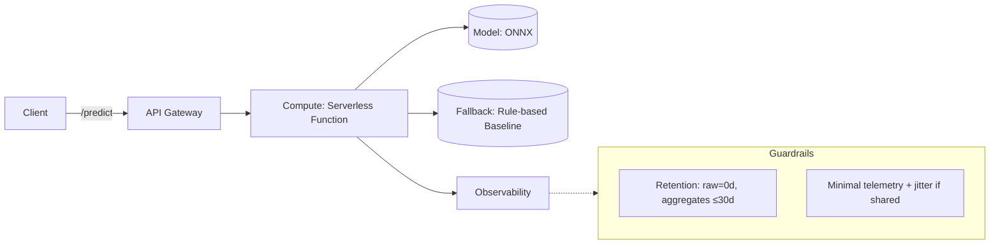

<<<<<<< HEAD
# productivity-proxy-prediction-API
=======
# Project Specification Draft

**Title:** Productivity Proxy Prediction API for Students

---

## 1. User & Decision

This API is designed for students who want to manage their study
schedules more effectively. As a student, predicting _"How productive
will I be today?"_ can help decide whether to push through assignments,
take breaks, or reduce distractions. The goal is not to perfectly
measure true productivity, but to provide a **proxy productivity score**
based on lifestyle inputs. Even with limited resources (free-tier cloud
services), this API should deliver useful insights without excessive
cost.

---

## 2. Target & Horizon

- **Target**: A **daily productivity proxy score** (0-10) based on
  self-reported stress, attention span, or productivity scores from
  open datasets.
- **Horizon**: 12-24 hours (today or the next day).
- **Justification**: Productivity cannot be objectively measured at
  scale, but proxy labels offer a practical and ethical way to
  approximate it.

---

## 3. Features

- **Available at prediction time**:

  - `sleep_hours` (T-8h): reported upon waking
  - `stress_level` (T-1h): self-report before prediction
  - `previous_day_productivity` (T-24h): historical label from yesterday

- **Excluded to avoid leakage**:
  - `today_task_completion` (T+12h): only known after prediction
  - `post-report survey data`: collected after prediction time

All features included are available **before T0** (the time of prediction), ensuring no label leakage.
(No Leakage)

- **Core inputs**:
  - `sleep_hours` (previous night)
  - `caffeine_mg` (consumed today)
  - `screen_time_hours` (today or previous day)
- **Optional**: bedtime, notification counts.
- **No leakage**: All features are past or current values; no future
  data is used.

---

## 4. Baseline

- **Baseline**: Heuristic rule – if `stress_level` > 3 and `sleep_hours` < 6, then productivity ≤ 5.
- **Model**: Logistic regression using `sleep_hours`, `stress_level`, `previous_day_productivity`, and time-of-day.
- **Hypothesis**: The model is expected to outperform the baseline by improving precision by ≥ 10% at similar recall, especially in low-sleep/high-stress regimes.
  → Model Plan

- **Baseline**: Rule-based model.
  - sleep \< 6h → lower score
  - caffeine 0-200mg → slightly higher score; \> 400mg → lower
    score
  - screen_time \> 6h → lower score
- **Model**: Lightweight regression (Linear Regression).
- **Deployment**: Model exported to ONNX for small size and fast
  inference in serverless environments.

---

## 5. Metrics, SLA, and Cost

- **Metrics**: RMSE / MAE (continuous), Brier score (probabilities).
- **SLA**:
  - p95 latency ≤ 300ms
  - cold start \< 1s
  - availability ≥ 99%
- **Cost constraints (student reality)**:
  - Free-tier limits on AWS Lambda or Vercel (millions of free
    invocations/month).
  - No GPU usage; CPU-only inference.
  - No paid monitoring; instead, lightweight logging.
- **Viral spike survival**: In case of 50k req/h, switch to rule-based
  fallback that runs instantly with no compute cost.

---

## 6. API Sketch

**Endpoint:** `POST /v1/predict`

**Request**:

```json
{
  "sleep_hours": 6.2,
  "caffeine_mg": 120,
  "screen_time_hours": 5.5
}
```

**Response**:

```json
{
  "proxy_productivity_score": 6.8,
  "uncertainty": 0.2,
  "risk_factors": ["late_bedtime", "high_screen_time"],
  "suggestion": "Reducing screen time by 1h could increase score by ~0.5"
}
```

---

## 7. Privacy, Ethics, Reciprocity (PIA excerpt)

- **Data**: Lifestyle features only; no PII.
- **Guardrails**:
  - Reject extreme values (caffeine \> 1000mg).
  - No storage of individual data (stateless API).
  - Telemetry only in aggregate with jitter/noise.
- **Reciprocity**: Users receive actionable recommendations (not just
  a score). Example: "Cutting screen time improves predicted
  productivity."

---

## 8. Architecture & Feasibility

**Architecture**:

- Client → API Gateway → Serverless (AWS Lambda or Vercel) → ONNX model

**Degrade mode**:

- If free-tier compute limits are reached or latency spikes, switch to
  baseline rule predictions.

**Trade-offs**:

- Serverless (cheap, scales automatically) vs container (expensive, not
  feasible for free-tier students).
- For students, serverless is the only realistic option; cold starts are
  acceptable if rare.

---

## 9. Risks & Mitigations

- **Risk**: Dataset labels (stress, attention) are proxies, not true
  productivity.
  - _Mitigation_: Acknowledge in documentation; use assumption
    audit.
- **Risk**: Free-tier limits exceeded.
  - _Mitigation_: Automatic degrade mode to baseline rules.
- **Risk**: Noisy self-report features.
  - _Mitigation_: Provide uncertainty values; clip extreme inputs.

---

## 10. Measurement Plan

- **Minimal experiment**:
  - Train/test split on Kaggle dataset with productivity-related
    proxies.
  - Compare baseline RMSE vs model RMSE.
- **SLA test**:
  - Simulate free-tier limits; measure latency under \~1k req/min.
  - Test fallback baseline mode for stability.

---

## 11. Evolution & Evidence

<<<<<<< HEAD
- **Git evidence**: Spec refinements, PIA updates, architecture
  diagram changes.
- **Socratic log**: Include examples of AI collaboration, corrections,
  and prompt evolution.
- **Assumption audit**: Document and test assumptions like "more sleep
  → higher productivity proxy score."

---

## ✦ Conclusion

This API provides a realistic, low-cost solution for predicting daily
productivity proxies based on lifestyle inputs. It acknowledges the
limits of using stress and attention span as proxies, while still
offering practical value to students. The architecture is feasible under
free-tier constraints, with fallback strategies to handle viral load.
The design covers rubric requirements in problem framing, specification
clarity, privacy/ethics, baseline evaluation, architecture, risks, and
evolution.

# API Sketch – Productivity Proxy Prediction API

## Endpoints Table

| Method | Endpoint      | Description                            | Auth         |
| ------ | ------------- | -------------------------------------- | ------------ |
| POST   | `/v1/predict` | Predict daily productivity proxy score | Bearer Token |
| GET    | `/v1/health`  | Health check (latency + status)        | None         |

---

## Example Request (POST /v1/predict)

```json
{
  "sleep_hours": 6.2,
  "caffeine_mg": 120,
  "screen_time_hours": 5.5
}
```

## Example Response (200 OK)

```json
{
  "proxy_productivity_score": 6.8,
  "uncertainty": 0.2,
  "risk_factors": ["late_bedtime", "high_screen_time"],
  "suggestion": "Reducing screen time by 1h could increase score by ~0.5"
}
```

---

## Example Error Response (400 Bad Request)

```json
{
  "error": "Invalid input: caffeine_mg must be between 0 and 1000"
}
```

---

## Authentication & Rate Limits

- **Auth**: All prediction requests require a **Bearer token** in the header
  ```
  Authorization: Bearer <token>
  ```
- **Rate limits**: Free-tier students limited to **60 requests/min per token**
- **Unauthenticated requests**: Only `/v1/health` is open

# Architecture Diagram & Minimal Evaluation Plan

## Architecture Diagram (Mermaid)



## Minimal Evaluation Plan

**Baseline**

- Rule-based: sleep <6h → score↓, caffeine >400mg → score↓, screen_time >6h → score↓

**Model**

- Lightweight regression (Linear/XGBoost), exported to ONNX

**Metrics**

- RMSE / MAE (continuous proxy score)
- SLA metric: p95 latency ≤ 300ms, cold start < 1s

**Evaluation**

- Train/test split on open dataset (proxy labels: stress, attention span, productivity)
- Compare RMSE of baseline vs model
- Load test: simulate 1k req/min (fits free-tier), test viral spike (50k req/h) with fallback
<<<<<<< HEAD
>>>>>>> eb07029 (add diagram and evaluation plan)
=======

# PIA Excerpt & Telemetry Decision Matrix
=======
### Insight Memo, Assumption Audit, Socratic Log, Git Evidence
>>>>>>> 506fb7d (update baseline model information)

## PIA Excerpt

<<<<<<< HEAD
- **Data Collected**: sleep_hours, caffeine_mg, screen_time_hours (lifestyle only, no PII)
- **Purpose**: predict proxy productivity score (0–10)
- **Retention**: none for raw inputs (0 days); aggregates kept ≤30 days
- **Access**: developer-only; no third-party sharing
- **Guardrails**: input validation (reject outliers), jitter/noise for aggregates, opt-in telemetry only
- **Disclaimer**: This API predicts a _proxy productivity score_, not medical or clinical outcomes.
=======
1. **Proxy ≠ Productivity**: Productivity cannot be measured directly. Using stress, attention span, and self-reported scores as proxies makes the target tractable but requires honesty about limitations.
2. **Free-tier Constraints Shape Architecture**: Designing for AWS Lambda/Vercel with fallback rules ensures the system remains viable for students without paid infrastructure. Cost limitations fundamentally influenced design choices.
3. **Baseline vs Model Trade-off**: Rule-based baselines are explainable and resilient at scale, while lightweight ML models add nuance. Maintaining both supports reliability under viral load.

#### Assumption Audit

- **Sleep hours ↑ → Productivity proxy score ↑** (assumed positive linear relation).
- **Caffeine has non-linear effect**: moderate intake improves score; excessive intake lowers score.
- **Screen time hours ↑ → Productivity proxy score ↓** (assumed negative correlation).
- **Inputs are self-reported and noisy**: must include uncertainty estimates and rejection of outliers.

#### Socratic Log References

**Q1:** Could I predict anxiety disorder from sleep, caffeine, and screen time?  
**A1:** That would raise serious ethical issues (medical diagnosis, misuse risk).  
➡ **Insight:** Avoid framing as clinical/medical prediction.

**Q2:** What if I reframe it as productivity prediction?  
**A2:** Productivity is vague, but you can use _stress/attention span/productivity scores_ as proxies.  
➡ **Insight:** Define the target explicitly as a **proxy productivity score**.

**Q3:** Isn’t caffeine always linked to higher productivity?  
**A3:** Not directly. Moderate caffeine can improve focus, but excessive caffeine worsens sleep and productivity.  
➡ **Insight:** Capture caffeine’s **non-linear effect** in baseline rules.

**Q4:** Should I deploy the model in containers instead of serverless?  
**A4:** Containers are stable but exceed free-tier constraints. For students, serverless + fallback is more practical.  
➡ **Insight:** Architecture shaped by **free-tier cost guardrails**.

**Q5:** Is this project too similar to CalmCast from the idea list?  
**A5:** CalmCast uses smartphone activity logs, while yours uses lifestyle factors (sleep, caffeine, screen time). Different framing, but important to clarify.  
➡ **Insight:** Explicitly highlight difference from prior idea to avoid overlap.

#### Git Evidence

```
commit 121bfd6180a0f34f7bc796ed5d6db17d75e104ef (HEAD -> main)
Author: Ina Lee <inalee1208@gmail.com>
Date:   Sun Sep 28 11:13:32 2025 -0700

    add PIA excerpt and Telemetry Decision matrix

commit eb070297f21d44ac3d88a8c445f18b84486235ae
Author: Ina Lee <inalee1208@gmail.com>
Date:   Sun Sep 28 11:12:01 2025 -0700

    add diagram and evaluation plan

commit 3238461d994ec2d35a3fea427202d484d9b55f57
Author: Ina Lee <inalee1208@gmail.com>
Date:   Sun Sep 28 12:06:59 2025 -0600

    add API sketch to README

commit 1951413c5e81148907d31d613b8579fc6275aa2d (origin/main, origin/HEAD)
Author: Ina Lee <inalee1208@gmail.com>
Date:   Sat Sep 27 16:27:11 2025 -0600

    update README.md

commit 1e0df43f81a119d47d663d983fe5788e922c79b4
Author: Ina <55104701+Ina-nk-lee@users.noreply.github.com>
Date:   Sat Sep 27 16:09:08 2025 -0600

    Initial commit
```

---

## ✦ Conclusion

This API provides a realistic, low-cost solution for predicting daily
productivity proxies based on lifestyle inputs. It acknowledges the
limits of using stress and attention span as proxies, while still
offering practical value to students. The architecture is feasible under
free-tier constraints, with fallback strategies to handle viral load.
The design covers rubric requirements in problem framing, specification
clarity, privacy/ethics, baseline evaluation, architecture, risks, and
evolution.

# API Sketch – Productivity Proxy Prediction API

## Endpoints Table

| Method | Endpoint      | Description                            | Auth         |
| ------ | ------------- | -------------------------------------- | ------------ |
| POST   | `/v1/predict` | Predict daily productivity proxy score | Bearer Token |
| GET    | `/v1/health`  | Health check (latency + status)        | None         |

---

## Example Request (POST /v1/predict)

```json
{
  "sleep_hours": 6.2,
  "caffeine_mg": 120,
  "screen_time_hours": 5.5
}
```

## Example Response (200 OK)

```json
{
  "proxy_productivity_score": 6.8,
  "uncertainty": 0.2,
  "risk_factors": ["late_bedtime", "high_screen_time"],
  "suggestion": "Reducing screen time by 1h could increase score by ~0.5"
}
```

---

## Example Error Response (400 Bad Request)

```json
{
  "error": "Invalid input: caffeine_mg must be between 0 and 1000"
}
```

---

## Authentication & Rate Limits

- **Auth**: All prediction requests require a **Bearer token** in the header
  ```
  Authorization: Bearer <token>
  ```
- **Rate limits**: Free-tier students limited to **60 requests/min per token**
- **Unauthenticated requests**: Only `/v1/health` is open

# Architecture Diagram & Minimal Evaluation Plan & Telemetry Decision Matrix

## Architecture Diagram (Mermaid)


## Minimal Evaluation Plan

**Baseline**

- Rule-based: sleep < 6h → score↓, caffeine > 400mg → score↓, screen_time > 6h → score↓

**Model**

- Lightweight regression (Linear/XGBoost), exported to ONNX

**Metrics**

- RMSE / MAE (continuous proxy score)
- SLA metric: p95 latency ≤ 300ms, cold start < 1s

**Evaluation**

- Train/test split on open dataset (proxy labels: stress, attention span, productivity)
- Compare RMSE of baseline vs model
- Load test: simulate 1k req/min (fits free-tier), test viral spike (50k req/h) with fallback
>>>>>>> 506fb7d (update baseline model information)

## Telemetry Decision Matrix

| Data Type              | Collected? | Granularity  | Retention | Guardrails / Notes              |
| ---------------------- | ---------- | ------------ | --------- | ------------------------------- |
| Input payloads         | ❌         | N/A          | 0 days    | Stateless; no storage           |
| Prediction outputs     | ❌         | N/A          | 0 days    | Returned to client only         |
<<<<<<< HEAD
| Aggregate metrics      | ✔️         | Daily totals | ≤30 days  | Jitter/noise added; opt-in only |
| Latency / SLA metrics  | ✔️         | p95, avg     | ≤30 days  | Used for SLA monitoring         |
| Error counts           | ✔️         | Aggregate    | ≤30 days  | No raw input stored             |
| User identifiers (PII) | ❌         | N/A          | N/A       | Never collected                 |
>>>>>>> 121bfd6 (add PIA excerpt and Telemetry Decision matrix)
=======
| Aggregate metrics      | ✔️         | Daily totals | ≤ 30 days | Jitter/noise added; opt-in only |
| Latency / SLA metrics  | ✔️         | p95, avg     | ≤3 0 days | Used for SLA monitoring         |
| Error counts           | ✔️         | Aggregate    | ≤ 30 days | No raw input stored             |
| User identifiers (PII) | ❌         | N/A          | N/A       | Never collected                 |
>>>>>>> 506fb7d (update baseline model information)
